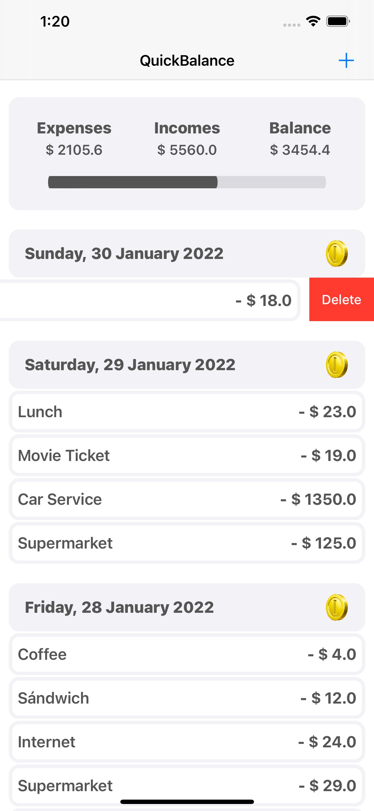

# QuickBalance

It all started with an interview ...

## Assignment 

  iOS  application with the following options: 

  * Add/delete income  and  expenses. 
  * List  of  expenses/incomes grouped by day 
  * Progress bar showing the expenses made by the user. 
  * Custom view  which  displays  total  expense,  total  income  and  remaining  balance. 
  * Data must be persisted

## Technical Requirements
* Xcode 13.2.1
* Realm 10.20.0
* Deployment Target iOS 13.2

## What things did I use?

- MVC
- UIViewController
- UIView, UIImageView, UILabel
- UITableView, UIPageViewController
- UIActivityIndicator, UIProgressView
- UIAlertController, ActionSheet
- UIStackView
- Constraints/Autolayout
- Delegation, Protocols
- Realm (add, delete, query)

## Screenshots

| Launch | Home | Empty | Add | Delete |
|:-------:|:----:|:-----:|:-----:|:-----:|
| |  |  |  |   |

## Gifs

| Home | Empty | Add | Delete |
|:----:|:-----:|:-----:|:-----:|
| |  |  |   |

